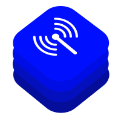

# BaseTrace

A framework of tools for researching the interface connecting the iPhone's application processor with its baseband chipset and related functionalities.

Read more about the different baseband chips part of iPhones
on [The Apple Wiki](https://theapplewiki.com/wiki/Baseband_Device).

The [CellGuard](https://github.com/seemoo-lab/CellGuard) iOS app for detecting rogue base station builds upon our insights gained from applying BaseTrace.
The app is available in a dedicated GitHub repository.

## Qualcomm Basebands

iPhones with Qualcomm basebands use the **Qualcomm MSM Interface (QMI)** protocol for iOS-baseband-communication.
Read more about the iPhone's baseband architecture in our paper "Catch You Cause I Can".

### [libqmi iOS Extensions](./libqmi-ios-ext)

iOS-specific protocol extension for the library [libqmi](https://gitlab.freedesktop.org/mobile-broadband/libqmi) used by the QMI dissector and CellGuard.

### [QMI Dissector](./qmi-dissect)

A Wireshark dissector for iPhones with Qualcomm basebands.

Works with all iPhones.

### [QMI Injector](./qmi-inject)

A tool to establish a direct communication link with Qualcomm basebands in iPhones, enabling you to inject custom QMI packets and receive the baseband's responses.

Requires a jailbroken iPhone.

## Intel & Apple Basebands

iPhones with Intel and Apple basebands use the **Apple Remote Invocation (ARI)** protocol for iOS-baseband-communication.
Read more about the protocol in Tobias' bachelor thesis and his paper ARIstoteles.

### [ARI Dissector](https://github.com/seemoo-lab/aristoteles/tree/master)

ARIstoles is a Wireshark dissector for iPhones with Apple or Intel basebands.

Works with all iPhones.

### [C1 Binary Ninja Loader](./c1-loader)

iPhones with Apple basebands (C1, C1X, ...) use ARM-based firmware.
Our loader for Binary Ninja enables you to decompile various binary firmware files.
The directory contains the tool's installation instructions.

## Apple Location Database

Apple's location database stores approximate locations for a Wi-Fi access points and cells part of the cellular network.
Read more about how different open location databases compare with Apple's database in our paper "Catch You Cause I Can".

### [Apple Location Services](./apple-location-services)

A standalone client for querying Apple's location database.

## Publications

- [Arnold L., Hollick M., Classen J. (2024): "Catch You Cause I Can: Busting Rogue Base Stations using CellGuard and the Apple Cell Location Database"](https://doi.org/10.1145/3678890.3678898)
- [Kröll T., Kleber S., Kargl F., Hollick M., Classen J. (2021): "ARIstoteles – Dissecting Apple’s Baseband Interface"](https://doi.org/10.1007/978-3-030-88418-5_7)
- [Kröll T. (2021): "ARIstoteles: iOS Baseband Interface Protocol Analysis"](https://tuprints.ulb.tu-darmstadt.de/id/eprint/19397)
