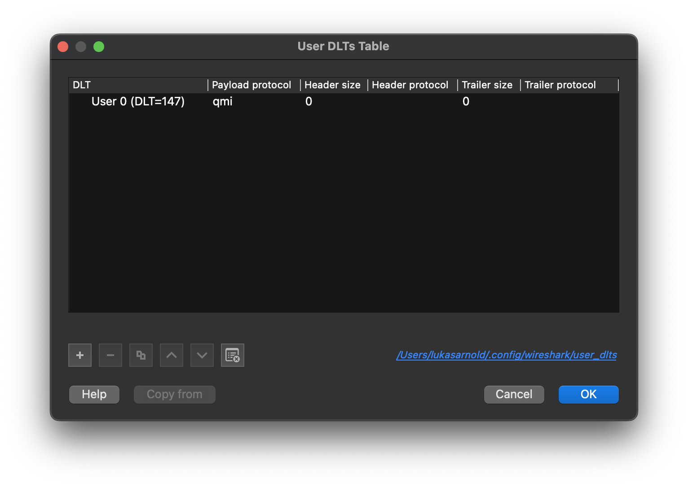

# Wireshark QMI Dissector
Analyze QMI packets of iPhone basebands in Wireshark.

## Installation
1. Clone libqmi repository
```sh
git clone https://gitlab.freedesktop.org/mobile-broadband/libqmi.git
```
2. Generate the dissector with
```sh
# If you're using Python < 3.4, please install pathlib using `pip3 install pathlib`
python3 generate_lua.py
```
3. Copy the generated dissector `build/qmi_dissector_gen.lua` to the [Wireshark plugin directory](https://www.wireshark.org/docs/wsug_html_chunked/ChPluginFolders.html)
  * Unix-like systems: `cp build/qmi_dissector_gen.lua ~/.local/lib/wireshark/plugins/`
  * Windows systems: `cp build\qmi_dissector_gen.lua %APPDATA%\Wireshark\plugins`
4. Configure the `DLT_USER` protocol: Open the Wireshark preferences -> Protocols -> DLT_USER -> Edit encapsulation table


## Research

You can discover new QMI message identifiers using the tools in the [research](research) directory.  

## Development

To get familiar with the development of Lua Wireshark dissectors, I recommend the following resources:
* Mika's Wireshark Guide
  * [Part 1](https://mika-s.github.io/wireshark/lua/dissector/2017/11/04/creating-a-wireshark-dissector-in-lua-1.html)
  * [Part 2](https://mika-s.github.io/wireshark/lua/dissector/2017/11/06/creating-a-wireshark-dissector-in-lua-2.html)
  * [Part 3](https://mika-s.github.io/wireshark/lua/dissector/2017/11/08/creating-a-wireshark-dissector-in-lua-3.html)
  * [Part 4](https://mika-s.github.io/wireshark/lua/dissector/2018/12/16/creating-a-wireshark-dissector-in-lua-4.html)
* Wireshark Documentation
  * [9.2. Adding a basic dissector](https://www.wireshark.org/docs/wsdg_html_chunked/ChDissectAdd.html)
  * [11. Wireshark’s Lua API Reference Manual](https://www.wireshark.org/docs/wsdg_html_chunked/wsluarm_modules.html)
  * [11.3. Functions For New Protocols And Dissectors](https://www.wireshark.org/docs/wsdg_html_chunked/lua_module_Proto.html#lua_class_Proto)
  * [11.5. Obtaining Packet Information](https://www.wireshark.org/docs/wsdg_html_chunked/lua_module_Pinfo.html#lua_class_Pinfo)
  * [11.20. User DLTs protocol table](https://www.wireshark.org/docs/wsug_html_chunked/ChUserDLTsSection.html)

## Contributors
### Wireshark Dissector for Qualcomm MSM Interface (QMI) Protocol v0.3

Optimized for analyzing QMI packets captured from iPhones.

Copyright (c) 2022 Lukas Arnold <lukas.arnold@stud.tu-darmstadt.de>

### Wireshark Dissector for Qualcomm MSM Interface (QMI) Protocol v0.2

Hosted on https://github.com/dnlplm/WiresharkQMIDissector

Copyright (c) 2017 Daniele Palmas <dnlplm@gmail.com>

### Based on:

- Wireshark Dissector for Qualcomm MSM Interface (QMI) Protocol v0.1
  Copyright (c) 2012 Ilya Voronin <ivoronin@gmail.com>
  https://gist.github.com/ivoronin/2641557

- Code Aurora Forum's BSD/GPL licensed code:
  http://www.codeaurora.org/contribute/projects/gobi/

- freedesktop.org libqmi
  https://www.freedesktop.org/wiki/Software/libqmi/
